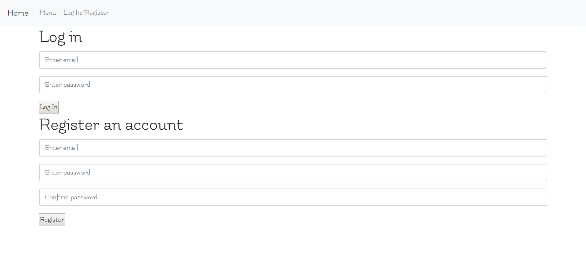
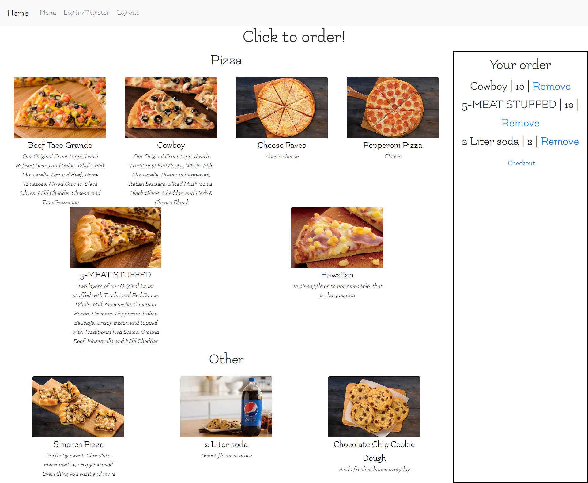
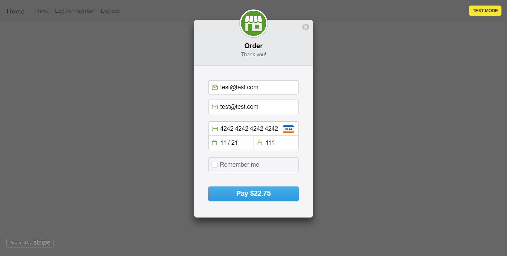
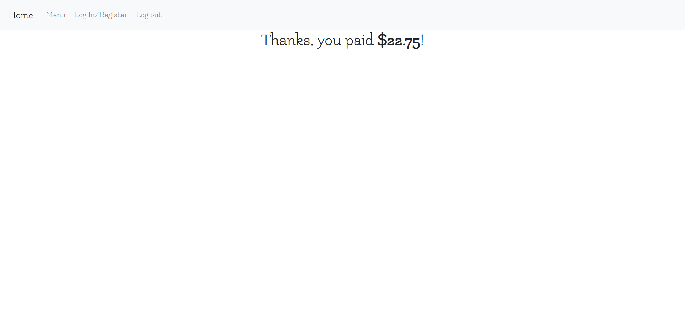
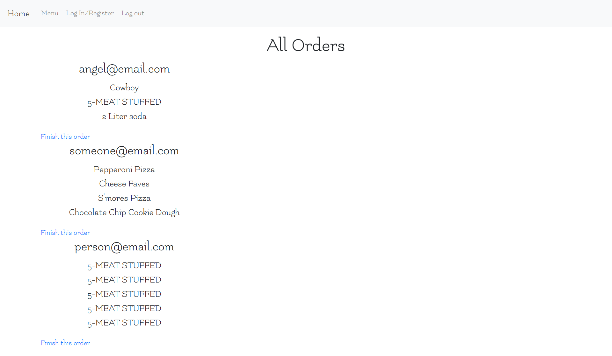

# Take home pizza ordering website inspired by Papa Murphy's user unfriendly website
- Visit the site here! Deployed using AWS [Check me out!](http://3.17.56.100/)

## Features
- User friendly
- Not confusing
- Straight forward user flow through site, no confusing routes or extra pages
- User authentication 
- Administrative features to perform CRUD operations to the database
- Stripe API integration

### Here's a simple overview of what a user could do

1. User will hit the landing page

2. User will log in

3. User can create an order (if not authenticated user will be rerouted to login)

4. User checks out order and pays via Stripe API

5. If payment processes they are rerouted to a thank you page

#### Admin features
1. User can log in with either the regular login above or this admin page

2. There are also forms to create, update, or delete items while logged in as an admin (Non admin users are rerouted to the home page)

